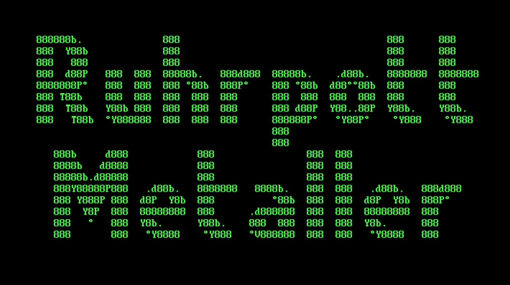

# ASCIIART
This is a software for generating ASCII banners on MS-DOS compatible operating systems.

The Demo alphabet is based on the 'colossal' font of the FIGlet Fonts Library: http://www.jave.de/figlet/fonts/details/colossal.html.

# Features
 * Define the ascii text to print.
 * Define the text color.
 * Define the horizontal starting points for each line of ascii art.
 * Define the vertical starting point.
 * Define a whole new ascii alphabet.

# License
This work is provided under the terms of the MIT license. Please take a look at the LICENSE file for the full text.

# Technology
This software is written in Quickbasic 4.5.

# Installation
 1. Install and configure DosBox if necessary (https://www.dosbox.com/).
 2. Grab a copy of Quickbasic 4.5.
 3. Add the Quickbasic folder to the PATH variable. Open "Options/Search Paths" in Quickbasic and add the Quickbasic folder as the folder for include files and help files. 
 4. Clone or download this repository.
 5. Navigate in the DOS terminal to the repository folder and open the project with QB MAIN.BAS.

# Using
## Defining your preferences
You can make preferences in the Data section of the MAIN.BAS file. The row numbers should always start with zero.
* `textHeight% = <Integer>`: The number of rows of the textToPrint$()-Array.
* `startPos(<Row as Integer>).x = <Integer>`: The vertical starting point of the ascii art.
* `startPosY% = <Integer>`: The horizontal starting point of the ascii art from the top.
* `text(<Row as Integer>) = "<String>"`: An array containing the text to print.
* `COLOR <Integer>`: The color of the ascii art according to this table: http://qbasicofsanjay.blogspot.com/2012/05/color-statement-and-color-codes.html

## Defining the alphabet
* ASCII art characters are defined in the ALPHABET.BI file. Do not forget to predefine the array containing the character in the file header. Note the heightChar variable.
* All ASCII art characters have to be registered in the selectAndPrintChar function of the MAIN.BAS file.
* You have to close and reopen the Quickbasic IDE before you can use the new ASCII art characters.

# Contact
If you have any question, just drop a message at ruhrpottmetaller@freenet.de.